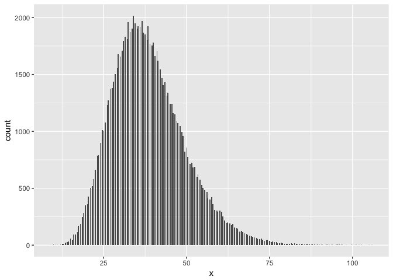
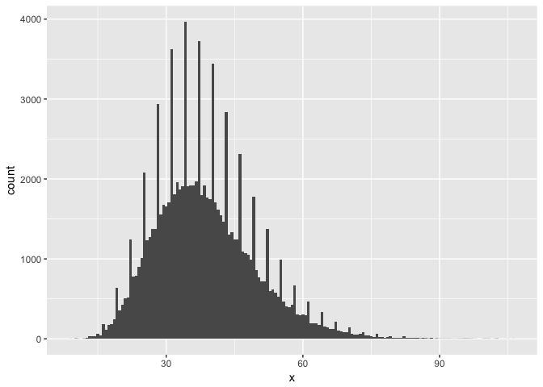
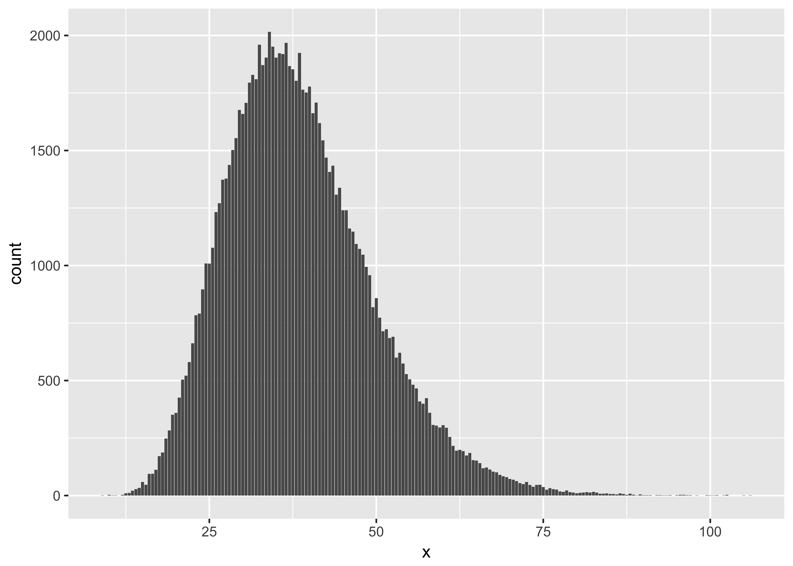
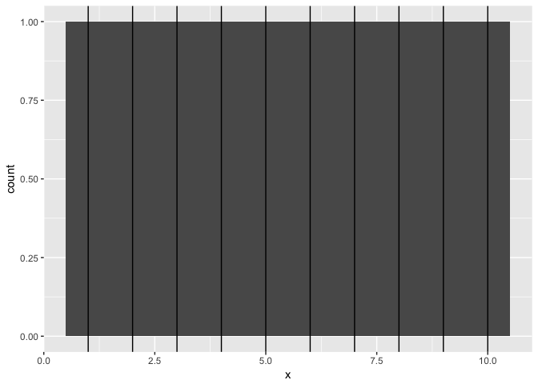
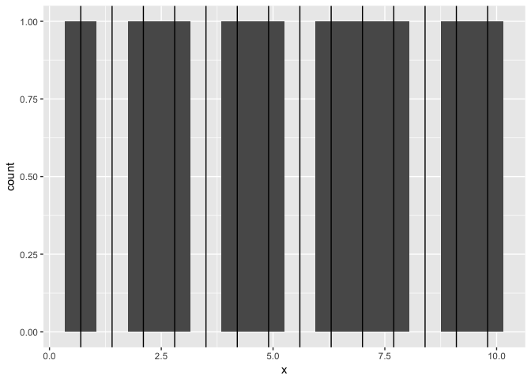
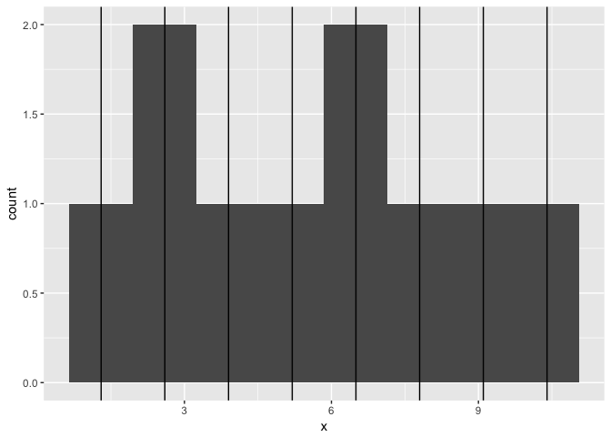

Histogram or Bar Chart?
================

By David W. Body / [Big Creek Software, LLC](https://www.bigcreek.com/)

Follow me on Twitter: [@david\_body](https://twitter.com/david_body)

#### TL;DR

Histograms are fine for continuous data. But if your data is discrete, use a bar chart instead.

Background
----------

I'm writing this up in the hope that it will help someone else avoid a rookie data visualization mistake that I recently made. I had generated some data from a simulation and I wanted to visualize the distribution, so I started plotting histograms. As usual, I experimented with various bin widths. But I started seeing plots like this:

``` r
library(ggplot2)
g <- ggplot(x, aes(x = x))
g <- g + geom_histogram(binwidth = 0.3)
g
```



Why are there gaps? Or this:

``` r
g <- ggplot(x, aes(x = x))
g <- g + geom_histogram(binwidth = 0.6)
g
```



WTF? That can't be right.

The mistake and how to fix it
-----------------------------

I didn't immediately realize it, but a histogram is *not* the appropriate plot to visualize my data.

My data is actually discrete rather than continuous. That's the nature of simulation that produced the data.

For discrete data, we really want to plot a bar chart with the counts of each value.

``` r
g <- ggplot(x, aes(x = x))
g <- g + geom_bar()
g
```



Why is a histogram innappropriate for discrete data?
----------------------------------------------------

This is the key point I want to make. To understand why a histogram is not appropriate for discrete data, let's look at an example with much simpler data. Supposed `x` is just the integers from 1 to 10.

``` r
x <- data.frame(x = c(1:10))
```

To see why a histogram is inappropriate for this data, let's plot a few. We'll also add vertical lines to show where the bins are.

``` r
g <- ggplot(x, aes(x = x))
g <- g + geom_histogram(binwidth = 1)
g <- g + geom_vline(data = layer_data(g), aes(xintercept = x))
g
```



That looks exactly right. But it isn't really a fair test because our data is so simple that we knew in advance that a bin width of 1 would be "just right."

What if we used other bin widths? Here's a bin width of 0.7:

``` r
g <- ggplot(x, aes(x = x))
g <- g + geom_histogram(binwidth = 0.7)
g <- g + geom_vline(data = layer_data(g), aes(xintercept = x))
g
```



See those gaps? That's not an accurate representation of the data. And here's a bin width of 1.3:

``` r
g <- ggplot(x, aes(x = x))
g <- g + geom_histogram(binwidth = 1.3)
g <- g + geom_vline(data = layer_data(g), aes(xintercept = x))
g
```



See the problem? Now we've created spikes by bunching data together. This is also misleading.

Forcing discrete data into arbitrary bins can create gaps or bunching that doesn't exist in the data.

We can avoid these problems by using a bar chart for our discrete data:

``` r
g <- ggplot(x, aes(x = x))
g <- g + geom_bar()
g
```


Conclusion
----------

Histograms are fine for continuous data. But if your data is discrete, use a bar chart instead.
